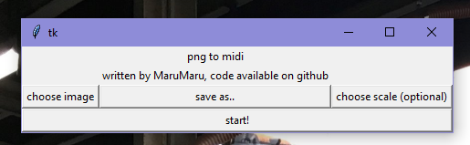

# pngtomidi
convert images to midi files  

  

Take a black and white image and convert it into a playable midi!  
Even better, take a black and white image and convert it into a specified key!  
Make weird music i guess. 
